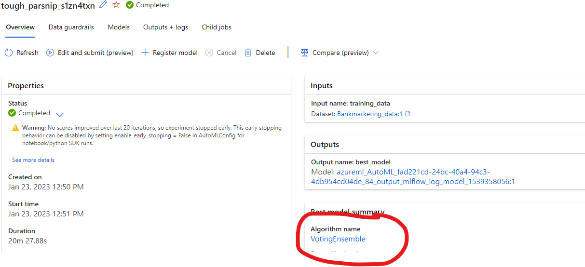
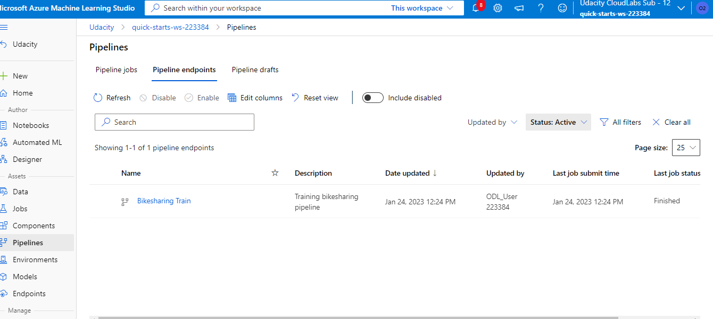

## Project Overview
#### link to the video: https://drive.google.com/file/d/1oeLCvsgw7a21us9xhdgAYlde5oIomFZh/view?usp=sharing
In this project, we have used Bank Marketing dataset to train a machine learning model using AutoML feature of Azure Machine Learning Studio and later configure it for production and deploy it using Azure Container Instance and later consume it using REST endpoints. We will also create, publish and consume a pipeline using a bike sharing dataset. In consuming the pipeline, we will be using Insomnia desktop application.

## MODEL ARCHITECHTURE

## KEY STEPS
1. Creating compute cluster and compute instance which we can use for running our jupyter notebooks and for deploying models in this project
2. Starting autoML exp using the banking dataset and selecting the best model which will be deployed

3. Creating and publishing ml pipeline with autolm step using the bikesharing dataset.

4. Deploying pipelines and consuming it with Insomnia

