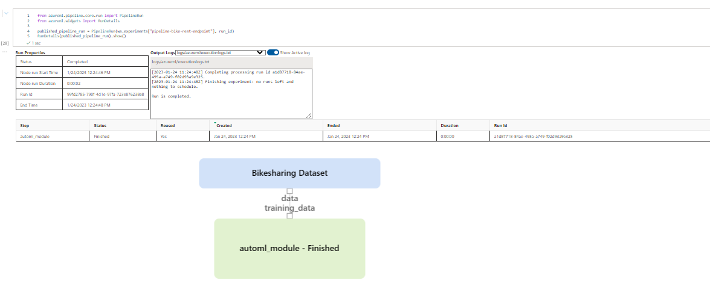
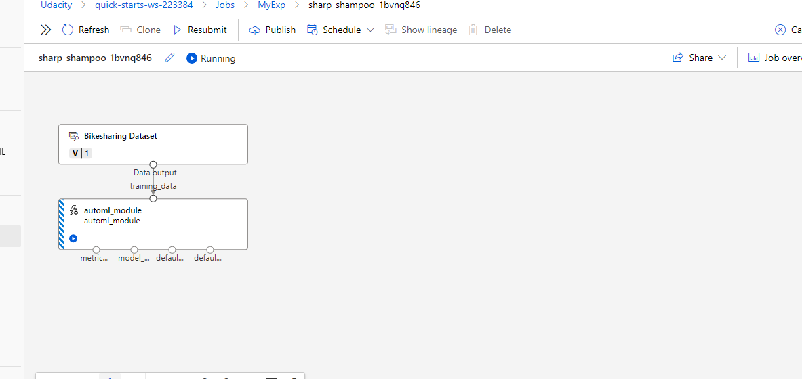
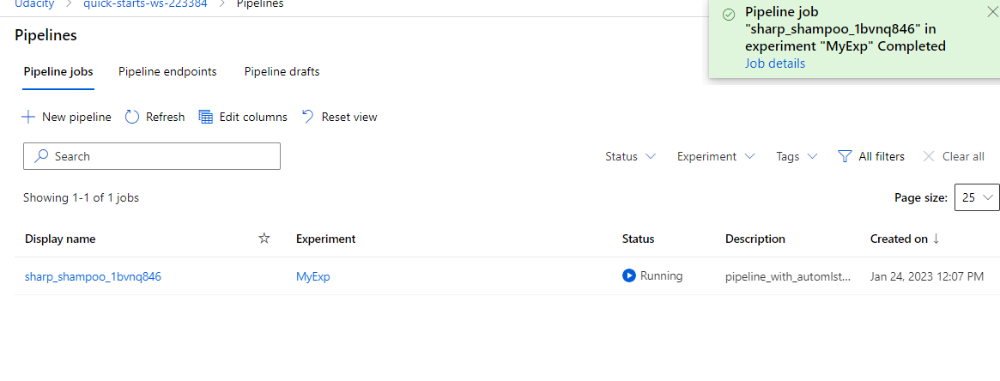
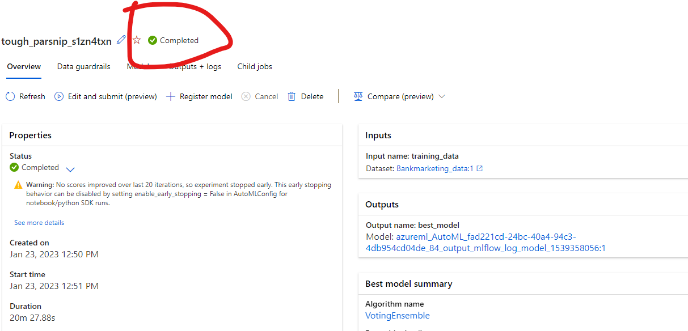
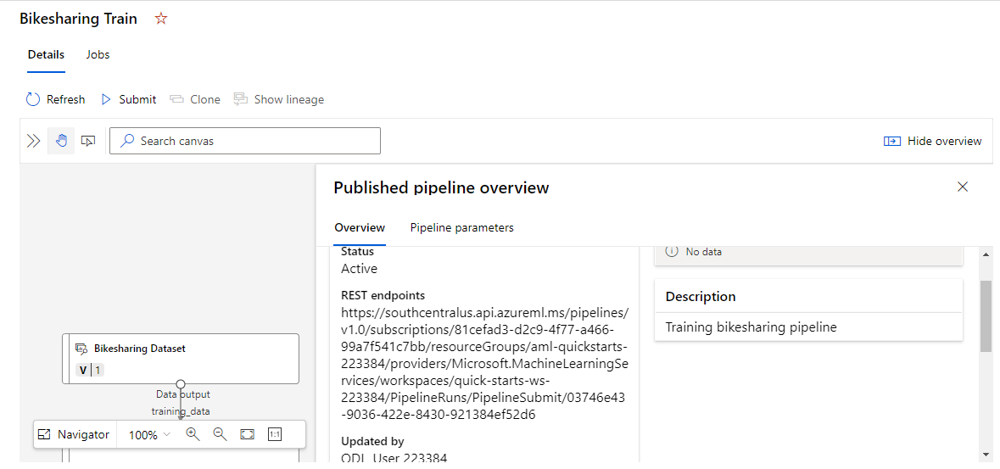
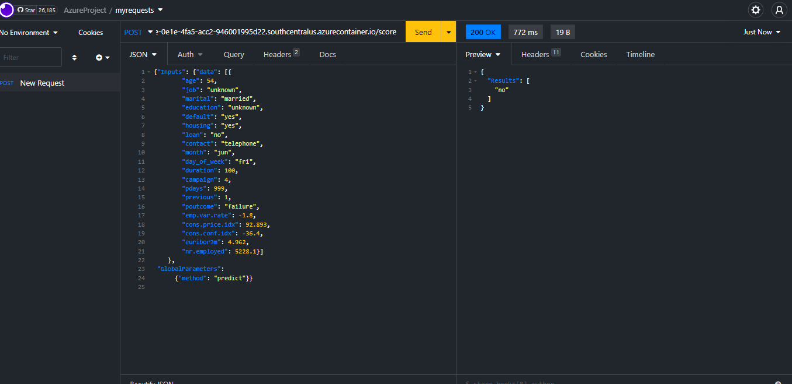
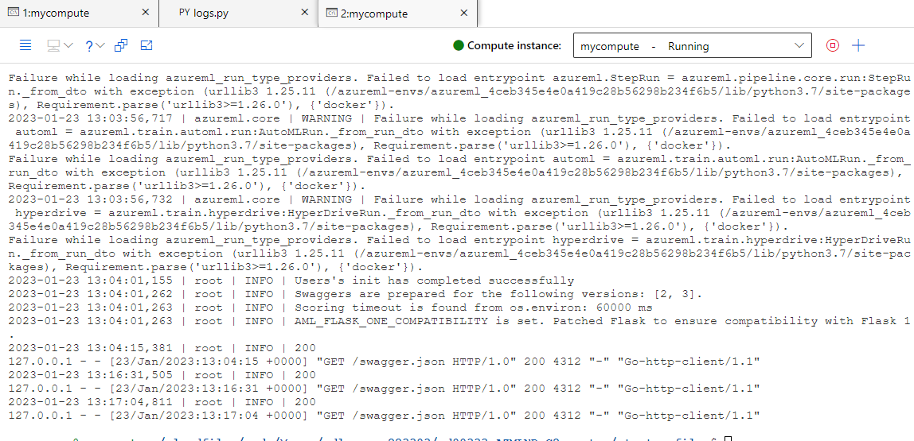

## Project Overview
#### link to the video: https://drive.google.com/file/d/1oeLCvsgw7a21us9xhdgAYlde5oIomFZh/view?usp=sharing
In this project, we have used Bank Marketing dataset to train a machine learning model using AutoML feature of Azure Machine Learning Studio and later configure it for production and deploy it using Azure Container Instance and later consume it using REST endpoints. We will also create, publish and consume a pipeline using a bike sharing dataset. In consuming the pipeline, we will be using Insomnia desktop application.

## MODEL ARCHITECHTURE

## KEY STEPS
1. Creating compute clusters

2. Starting autoML exp
3. Creating and publishing ml pipeline
4. Deploying pipelines and consuming it with Insomnia

