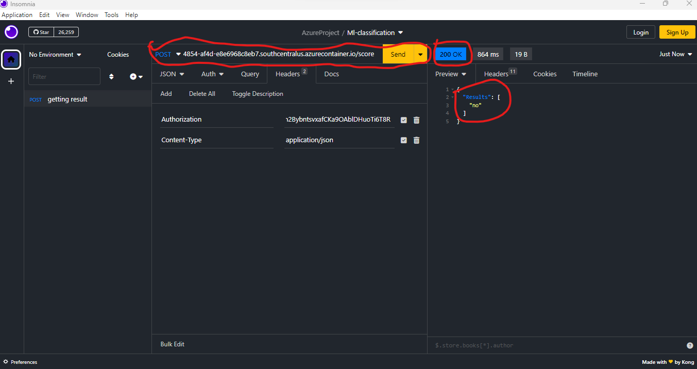

# Project Overview
In this project, we have used Bank Marketing dataset to train a machine learning model using AutoML feature of Azure Machine Learning Studio and later configure it for production and deploy it using Azure Container Instance and later consume it using REST endpoints. We will also create, publish and consume a pipeline using a bike sharing dataset. We will also create a published pipeline which can be used to run the pipeline using its REST endpoint

# MODEL ARCHITECHTURE

# Shorts description of how to improve projects
1. In this project, we were not really focused on getting a very accurate model. This can be done to improve the project
2. We can also export the model to support ONNX

# KEY STEPS
## Creating Compute clusters
The project starts by creating compute clusters for deploying and running experiments and also compute instance that can be used for running our scripts.

## Uploading Datasets
The dataset used for this experiment are uploaded to the datastore

## Starting AutoML run
Starting autoML run under the "ml-experiment" job. limiting the run to one hour.

## Create ML pipeline
Creating and publishing ml pipeline with autolm step using the bikesharing dataset.

## Publishing pipeline enpoint
Published a pipeline endpoint that can be used to start trigger the pipeline using its ACTIVE RESTENDPOINT

## Deploy Best ML models
Deploying ML models and enabling application insight

## Consume Ml models
Here, we have decided to consume the REST endpoint using insomnie, an application used to consume apis. ALso we can see our requests reflected on the logs.py. We also send request using enpoint.py script.

## Using the swagger for consuming the endpoint

# Link to the screencast
link to the video: https://drive.google.com/file/d/12wvdmt6vmTWSKiQ08-D52_Ek7zHjpYip/view?usp=sharing

# Description of script
1. "Log.py" is used to view the logs of the model endpoint
2. "Enpoint.py" is used to send request to the model enpoint
3. "aml-exercise-pipelines-with-automated-machine-learning-step.ipynb" is used for the creating and deploying pipeline endpoint
